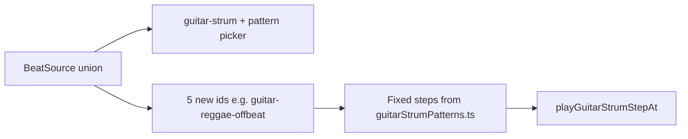

# Latin / Reggae patterns as separate Beat Sources

## Requirement (iteration)

Patterns must **not** live only under the existing **Guitar strum** flow (the secondary "Strum feel and pattern" selector). Each new style should appear as its **own entry under Beat source** in the Studio metronome.

## Architecture

- Keep **[`src/data/guitarStrumPatterns.ts`](src/data/guitarStrumPatterns.ts)** as the single source for **step arrays** (D/U/G/R), `notation`, `bestFor`, and display names.
- Extend **`BeatSource`** in [`useAdvancedMetronome.ts`](src/hooks/metronome/useAdvancedMetronome.ts) with **five new string literals** (names should be stable and URL-safe), for example:
  - `guitar-reggae-offbeat`
  - `guitar-ska-chank`
  - `guitar-bossa-nova`
  - `guitar-montuno`
  - `guitar-partido-samba`
- Add a small helper, e.g. **`getGuitarPatternIdForBeatSource(beatSource): GuitarStrumPatternId | null`**, returning:
  - `null` for non-guitar sources and for `guitar-strum` (user-chosen pattern id stays in state).
  - The **fixed** pattern id for each of the five new beat sources.
- In **`scheduleNotes`**, case `guitar-strum`: unchanged (uses `guitarStrumPatternId` from hook args).
- For each new beat source case: call `getGuitarStrumPattern(fixedId)` → `getGuitarPatternCellIndex` → `metronomeAudio.playGuitarStrumStepAt(...)` (same as today).

**Hook signature:** Keep `guitarStrumPatternId` **only** for `beatSource === 'guitar-strum'`; it is ignored when another guitar-related beat source is selected (or document that the five new sources always use a fixed pattern).

## UI — [`AdvancedMetronome.tsx`](src/components/metronome/AdvancedMetronome.tsx)

- **Beat source** `<select>`: add **five `<option>`s** (group under one or more `<optgroup>`s, e.g. "Reggae / Caribbean" and "Latin" for clarity).
- **`BEAT_SOURCE_PATTERN_HINT` / placeholder copy:** add entries for each new `BeatSource` id (notation line + short blurb).
- **Strum pattern sub-dropdown:** show **only when** `beatSource === 'guitar-strum'`. For the five new beat sources, the **Sound pattern** card shows the same style as other pattern modes: read-only **bestFor** + **notation** from `getGuitarStrumPattern(fixedId)`—no second selector.

## Docs

- Optional one-line in [`docs/metronome.md`](docs/metronome.md): Beat Source can include multiple guitar strum presets.

## Verification

- `npm run typecheck` / `npm run build`.
- Manually: pick each new beat source, confirm audio follows the correct fixed pattern and the UI shows the right hint without the guitar pattern picker.

## Out of scope

- Changing default `BeatSource` or removing `guitar-strum`.
- Sample-based audio (still synthesis via existing engine).
