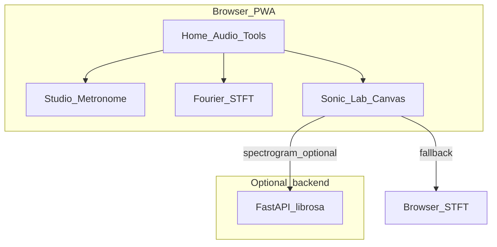

# Music Studio

Browser-based audio tools for practice and exploration: a **studio metronome**, a **Fourier / spectrum lab**, and **Sonic Fingerprint Lab** visualizations. Ships as a **PWA**, with an **optional FastAPI** service for richer spectrograms, and **Capacitor** wrappers for mobile.

**Live demo:** `https://<your-github-username>.github.io/<repo>/` — replace with your GitHub Pages URL after enabling Pages on the `deploy` branch.

**Screenshots:** add 2–4 images under `docs/images/` (or your host of choice) and link them here to showcase the home screen, metronome, Fourier view, and Sonic Lab.

## Features

- **Studio metronome** — Web Audio scheduling, meters, accents, synthesized kit and pattern modes, visual tracker, multiple UI themes. Implementation map: [docs/metronome.md](docs/metronome.md).
- **Fourier & spectrum** — Single-frame spectrum and time–frequency (STFT) views with adjustable FFT size, window, and overlap; decode local audio in the browser.
- **Sonic Fingerprint Lab** — Upload or URL load, reference tones, visualization modes (waveform, density, solid, phase / Lissajous, mandala, spectrogram). Spectrogram uses an in-browser STFT by default; optionally uses the Python backend for a librosa/mel-style render when `VITE_API_BASE_URL` points at a deployed API (see [backend/README.md](backend/README.md)).

**Static hosting (e.g. GitHub Pages alone):** the full UI runs offline-capable from `dist/`; only the optional **hosted** FastAPI spectrogram path needs a separate deploy + env var. Everything else is client-side.

## Tech stack

- **Frontend:** React 18, TypeScript, Vite 5, Tailwind CSS, Web Audio API, [vite-plugin-pwa](https://vite-pwa-org.netlify.app/)
- **Mobile:** Capacitor 8 (`@capacitor/android`, `@capacitor/ios` in dependencies)
- **Optional backend:** FastAPI, librosa, matplotlib ([backend/README.md](backend/README.md))

## Repo map

| Area | Location |
|------|----------|
| Studio metronome (source map & data flow) | [docs/metronome.md](docs/metronome.md) |
| Optional Sonic Lab API (spectrogram, upload, CORS proxy) | [backend/README.md](backend/README.md) |
| Experimental structure-analysis API (**not wired** to the current web app) | [fusion/README.md](fusion/README.md) |

## Quick start

```bash
npm install
npm run dev
```

Opens the Vite dev server at **http://localhost:5175**.

**Optional:** run the Sonic Lab backend in another terminal so `/api` (proxied in dev) is available — see [backend/README.md](backend/README.md).

## Quality (local checks)

```bash
npm run typecheck
npm run lint
```

## CI

- **Deploy:** on push to `main` or `master`, [`.github/workflows/deploy-pages.yml`](.github/workflows/deploy-pages.yml) runs `npm run build:pages` and publishes `dist/` to the **`deploy`** branch for GitHub Pages.
- **Verify:** [`.github/workflows/pages-verify.yml`](.github/workflows/pages-verify.yml) runs the same Pages build on pushes and pull requests (no deploy).

**Studio metronome (implementation deep dive):** [docs/metronome.md](docs/metronome.md) — scheduling, `BeatSource` modes, Web Audio graph, accents.

## Architecture (high level)



## Web / PWA

- **Build:** `npm run build` — outputs `dist/` with a service worker and `manifest.webmanifest` (via [vite-plugin-pwa](https://vite-pwa-org.netlify.app/)).
- **Preview:** `npm run preview` — test the production build locally over HTTP.
- **Icons:** Regenerate PNGs under `public/icons/` with `npm run generate:icons` (requires devDependency `sharp`). Commit updated icons when the branding changes.
- **Deploy:** Host `dist/` behind **HTTPS** so install prompts and service workers work.

### GitHub Pages (deploy branch)

**Prereqs**

- Repo **Settings → Pages**: source = your **`deploy`** branch (or whichever branch contains the built site), folder **`/ (root)`** if you publish the contents of `dist/` at the branch root.
- **Project site URL** is `https://<user>.github.io/<repo>/` — Vite must use base `/<repo>/`. **User site** (`<user>.github.io` repository) uses base `/`.

**Build for Pages**

- **Locally** (replace `music-studio` with your repository name):

  ```bash
  VITE_BASE_PATH=/music-studio/ npm run build:pages
  ```

  This runs `vite build` and copies `dist/index.html` → `dist/404.html` (helps with SPA fallbacks on GitHub Pages).

- **GitHub Actions**: `GITHUB_REPOSITORY` is set automatically — a plain `npm run build:pages` in CI picks up `/<repo>/` without `VITE_BASE_PATH`.

**Capacitor / local dev**

- `npm run dev` and `npm run build` (no env) use base **`/`** — correct for local preview and for **`npm run build:mobile`**. Do **not** leave `VITE_BASE_PATH` exported in your shell when building native apps, or asset paths will be wrong for the WebView.

**Automatic deploy (Actions)**

- On every push to **`main`** (or **`master`**), [`.github/workflows/deploy-pages.yml`](.github/workflows/deploy-pages.yml) runs `npm run build:pages` (so `GITHUB_REPOSITORY` sets the right base) and pushes **`dist/`** to branch **`deploy`** with [peaceiris/actions-gh-pages](https://github.com/peaceiris/actions-gh-pages).
- In the repo: **Settings → Pages → Build and deployment → Branch** = **`deploy`**, folder **`/ (root)`**.
- First run: allow **Actions** permissions (**Settings → Actions → General → Workflow permissions**: read and write).

## Android (Capacitor)

1. `npm run build:mobile` — builds the Vite app and runs `cap sync` so `android/app/src/main/assets/public` matches `dist/`.
2. Open `android/` in Android Studio, then **Build → Build Bundle(s) / APK(s)** (or use Gradle) for a device or emulator.
3. For Play Store releases, configure signing, bump `versionCode` / `versionName` in `android/app/build.gradle`, and build an AAB.

**Security:** do not commit keystore files, API keys, or Play signing secrets; use Android Studio / CI secrets for release signing.

Generated Android/iOS web assets are listed in `.gitignore` and are recreated by the steps above.

### First debug APK on a device (minimal checklist)

**Prerequisites**

- [Android Studio](https://developer.android.com/studio) installed (includes Android SDK; accept SDK licenses when prompted).
- A physical phone with **Developer options → USB debugging** enabled, *or* an **Android Virtual Device** (AVD) created in Android Studio (**Device Manager**).

**Steps**

1. Install JS dependencies and build the web app + sync into Android:

   ```bash
   npm install
   npm run build:mobile
   ```

2. Open the native project: **File → Open** → select the repo’s `android/` folder (not the repo root). Wait for Gradle sync to finish.

3. Pick a run target: your USB device (trust the computer if prompted) or an emulator from the device dropdown in the toolbar.

4. Click **Run** (green play) with configuration **app**. Android Studio builds a **debug** APK, installs it, and launches Music Studio.

**If you only need the APK file (e.g. to sideload)**

- **Build → Build APK(s)**. When it finishes, choose **locate** in the notification, or find:

  `android/app/build/outputs/apk/debug/app-debug.apk`

- Install on a device with: `adb install -r android/app/build/outputs/apk/debug/app-debug.apk` (USB debugging on, `adb` on your `PATH`).

**After you change web code**

- Run `npm run build:mobile` again, then **Run** in Android Studio (or Build) so the embedded WebView picks up the new `dist/` assets.

**Play Store**

- Use a **release** build and an **AAB** (signed), not the debug APK above. Bump `versionCode` / `versionName` in `android/app/build.gradle` for each upload.

## iOS (Capacitor)

This repo documents Android in detail. For iOS, use the standard Capacitor flow after a web build: add the native project if needed (`npx cap add ios`), then `npm run build:mobile` and open `ios/App` in Xcode (`npx cap open ios`). Keep the same rule as Android: build the web app with base `/`, not a GitHub Pages base path, before syncing.

## Develop

- `npm run dev` — Vite dev server (port **5175**).
- **Dev-only:** “metronome audio graph lab” is available from the home screen when running `npm run dev` (`import.meta.env.DEV`).
