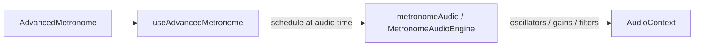

# Studio metronome — implementation

The **Advanced Metronome** (Studio) is a React + Web Audio metronome: synthesized cues (no sample files for core modes), a lookahead scheduler, and meter-based accents.

## Source map

| Area | File |
|------|------|
| UI (controls, beat source, sound picker) | [`src/components/metronome/AdvancedMetronome.tsx`](../src/components/metronome/AdvancedMetronome.tsx) |
| Visual tracker / pendulum | [`src/components/metronome/MetronomeVisualizer.tsx`](../src/components/metronome/MetronomeVisualizer.tsx) |
| State, playback, lead-in, **scheduling** | [`src/hooks/metronome/useAdvancedMetronome.ts`](../src/hooks/metronome/useAdvancedMetronome.ts) |
| **Audio engine** (single `AudioContext`, master gain) | [`src/utils/metronome/metronomeEngine.ts`](../src/utils/metronome/metronomeEngine.ts) |
| **Kit sounds** (nine `MetronomeSound` timbres) | [`src/utils/metronome/kit.ts`](../src/utils/metronome/kit.ts) |
| **Pattern / instrument** modes (tabla, guitar, piano, violin, drums) | [`src/utils/metronome/patternSynth.ts`](../src/utils/metronome/patternSynth.ts) |
| Sound list + per-sound output trim (metadata) | [`src/utils/metronome/catalog.ts`](../src/utils/metronome/catalog.ts) |
| Shared accent tiers (`none` / `normal` / `first`) | [`src/utils/metronomeAccent.ts`](../src/utils/metronomeAccent.ts) |
| Public barrel (re-exports) | [`src/utils/metronomeAudio.ts`](../src/utils/metronomeAudio.ts) |

## Data flow

1. The user sets BPM, **meter preset** (e.g. 4/4 16th), and **beat source** (`sounds`, `vocal`, `syllables`, or a pattern mode).
2. On **playing**, a `setTimeout` loop (`~25ms` lookahead) advances a **step index** and schedules the next event at `nextStepTime` using the shared `AudioContext` clock (not `Date.now()`).
3. For each step, the hook computes an **accent** and calls the right `metronomeAudio.play*At(…, audioTime, …)` method.

## Beat sources

`BeatSource` is defined in [`useAdvancedMetronome.ts`](../src/hooks/metronome/useAdvancedMetronome.ts). Modes include:

- **`sounds`**: one of nine kit timbres from [`catalog.ts`](../src/utils/metronome/catalog.ts) (`MetronomeSound`), rendered in [`kit.ts`](../src/utils/metronome/kit.ts).
- **`vocal`**: short formant-style pulse.
- **`syllables`**: `ta` / `ka` / `di` / `mi` (or `ta` / `ka` in 8th-based meters) with per-step syllable selection; subdivisions are attenuated relative to beat attacks.
- **Pattern modes** (`tabla-bols`, `guitar-strum`, `piano-arpeggio`, `violin-legato`, `drums-pattern`): implemented in [`patternSynth.ts`](../src/utils/metronome/patternSynth.ts).

## Accents

Accents are **not** user-drawn; they follow the **meter preset** (which beats in the bar are stressed) and a special case for the **bar downbeat** (first beat of the bar, first subdivision).

Logic lives in `getMetronomeAccentForStep` in [`metronomeAccent.ts`](../src/utils/metronomeAccent.ts) and is called from the scheduler in [`useAdvancedMetronome.ts`](../src/hooks/metronome/useAdvancedMetronome.ts).

- **`first`**: start of the bar (beat index 0, on a beat boundary).
- **`normal`**: other accented beats from the preset’s `accentedBeats` list.
- **`none`**: weak beats and subdivisions.

Shared gain/duration/brightness multipliers for many paths are `ACCENT_MULT`, `ACCENT_DURATION`, and `ACCENT_BRIGHT` in the same file. Kit-style sounds multiply a reference “normal” level by `ACCENT_MULT`. Pattern timbres (guitar, tabla, etc.) keep their own per-tier curves where the global table would not match.

## Lead-in

With lead-in enabled, the hook enters a **`lead-in`** state: optional `speechSynthesis` or short **count-in clicks** from `playCountInCueAt` on the engine, then switches to **`playing`** and aligns `nextStepTimeRef` so bar 1 starts after the count.

## Performance notes

- **Noise buffers** (e.g. syllable consonant burst, snare / hi-hat) are **cached by length** on the engine to avoid allocating `AudioBuffer` on every hit.
- Pattern outputs use a separate trim path from kit sounds (see `connectPatternOutput` in the engine).

## Classic metronome

This repo also ships a simpler “classic” metronome elsewhere in the app; the files above refer to the **Studio / Advanced** path. If you add features, keep shared audio concerns in the engine and accent modules to avoid duplicating Web Audio graph logic.
