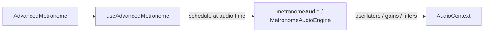

# Studio metronome — implementation

The **Advanced Metronome** (Studio) is a React + Web Audio metronome: synthesized cues (no sample files for core modes), a lookahead scheduler, and meter-based accents.

## Source map

| Area | File |
|------|------|
| UI (controls, beat source, sound picker) | [`src/components/metronome/AdvancedMetronome.tsx`](../src/components/metronome/AdvancedMetronome.tsx) |
| Visual tracker / pendulum | [`src/components/metronome/MetronomeVisualizer.tsx`](../src/components/metronome/MetronomeVisualizer.tsx) |
| State, playback, lead-in, **scheduling** | [`src/hooks/metronome/useAdvancedMetronome.ts`](../src/hooks/metronome/useAdvancedMetronome.ts) |
| **Audio engine** (single `AudioContext`, master gain) | [`src/utils/metronome/metronomeEngine.ts`](../src/utils/metronome/metronomeEngine.ts) |
| **Output graph** (per-sound + pattern bus → shared `METRONOME_MASTER_GAIN`) | [`src/utils/metronome/metronomeOutputGraph.ts`](../src/utils/metronome/metronomeOutputGraph.ts) |
| **Loudness metrics** (peak / short RMS for calibration) | [`src/utils/metronome/loudnessMetrics.ts`](../src/utils/metronome/loudnessMetrics.ts) |
| **Kit sounds** (nine `MetronomeSound` timbres) | [`src/utils/metronome/kit.ts`](../src/utils/metronome/kit.ts) |
| **Pattern / instrument** modes (tabla, guitar, piano, violin, drums, world grooves) | [`src/utils/metronome/patternSynth.ts`](../src/utils/metronome/patternSynth.ts) |
| Sound list + per-sound output trim (metadata) | [`src/utils/metronome/catalog.ts`](../src/utils/metronome/catalog.ts) |
| Shared accent tiers (`none` / `normal` / `first`) | [`src/utils/metronomeAccent.ts`](../src/utils/metronomeAccent.ts) |
| Public barrel (re-exports) | [`src/utils/metronomeAudio.ts`](../src/utils/metronomeAudio.ts) |
| **UI themes** (8 practice-focused presets, CSS variables) | [`src/lib/themes.ts`](../src/lib/themes.ts), [`src/index.css`](../src/index.css) (`[data-theme]` on the app shell) |
| **Guitar strum patterns (by “feel”)** | [`src/data/guitarStrumPatterns.ts`](../src/data/guitarStrumPatterns.ts); optional real samples: [docs/guitar-samples.md](guitar-samples.md), [`public/samples/guitar/`](../public/samples/guitar/) |

## Data flow

1. The user sets BPM, **meter preset** (e.g. 4/4 16th), and **beat source** (`sounds`, `vocal`, `syllables`, or a pattern mode).
2. On **playing**, a `setTimeout` loop (`~25ms` lookahead) advances a **step index** and schedules the next event at `nextStepTime` using the shared `AudioContext` clock (not `Date.now()`).
3. For each step, the hook computes an **accent** and calls the right `metronomeAudio.play*At(…, audioTime, …)` method.

## Beat sources

`BeatSource` is defined in [`useAdvancedMetronome.ts`](../src/hooks/metronome/useAdvancedMetronome.ts). Modes include:

- **`sounds`**: one of nine kit timbres from [`catalog.ts`](../src/utils/metronome/catalog.ts) (`MetronomeSound`), rendered in [`kit.ts`](../src/utils/metronome/kit.ts).
- **`vocal`**: short formant-style pulse.
- **`syllables`**: `ta` / `ka` / `di` / `mi` (or `ta` / `ka` in 8th-based meters) with per-step syllable selection; subdivisions are attenuated relative to beat attacks.
- **Pattern modes** (`tabla-bols`, `guitar-strum`, `piano-arpeggio`, `violin-legato`, `drums-pattern`): implemented in [`patternSynth.ts`](../src/utils/metronome/patternSynth.ts).
- **World groove modes** (Reggae, Ska, Bossa, Salsa/montuno, Samba) use their own `BeatSource` values (e.g. `reggae-one-drop`, `reggae-steppers-8`, `ska-offbeat-chank`, `bossa-8`, `salsa-montuno-8`, `samba-partido-8`). Timing still uses the D/U/G/R cell grids in [`guitarStrumPatterns.ts`](../src/data/guitarStrumPatterns.ts), but each mode has a **dedicated** synthesized timbre in `patternSynth.ts` (reggae and steppers share the organ skank; then brassy chank, nylon pluck, piano stab, pandeiro-like body) rather than the guitar strum model.

## Accents

Accents are **not** user-drawn; they follow the **meter preset** (which beats in the bar are stressed) and a special case for the **bar downbeat** (first beat of the bar, first subdivision).

Logic lives in `getMetronomeAccentForStep` in [`metronomeAccent.ts`](../src/utils/metronomeAccent.ts) and is called from the scheduler in [`useAdvancedMetronome.ts`](../src/hooks/metronome/useAdvancedMetronome.ts).

- **`first`**: start of the bar (beat index 0, on a beat boundary).
- **`normal`**: other accented beats from the preset’s `accentedBeats` list.
- **`none`**: weak beats and subdivisions.

Shared gain/duration/brightness multipliers for many paths are `ACCENT_MULT`, `ACCENT_DURATION`, and `ACCENT_BRIGHT` in the same file. Kit-style sounds multiply a reference “normal” level by `ACCENT_MULT`. Pattern timbres (guitar, tabla, etc.) keep their own per-tier curves where the global table would not match.

## Lead-in

With lead-in enabled, the hook enters a **`lead-in`** state: optional `speechSynthesis` (volume from `VOICE_COUNT_IN_UTTERANCE_VOLUME` in [`metronomeAccent.ts`](../src/utils/metronomeAccent.ts)) or short **count-in clicks** from `playCountInCueAt` (gain matched to a normal **woodblock** click via `ACCENT_MULT.normal * soundOutputTrim.woodblock`), then switches to **`playing`** and aligns `nextStepTimeRef` so bar 1 starts after the count.

## Visualizer and strum pattern

[`MetronomeVisualizer.tsx`](../src/components/metronome/MetronomeVisualizer.tsx) receives **`stepAudioRoles`** and **`stepStrumTokens`** from the hook (guitar-strum and world groove sources). **R** / **G** / **D** / **U** come from the same grid as audio. Downstrokes and upstrokes use theme CSS variables **`--metro-pulse-down`** (slate) and **`--metro-pulse-up`** (contrasting accent); **R** and **G** use dim and muted-green styling. Pendulum and bounce ball tints the bob by the current step’s token.

## Output level (objective, one-shots)

- **Not LUFS** as the primary number: EBU R128 / ITU-R BS.1770 are built for long-form program loudness. Metronome hits are 40–200 ms; the practical target is **full-scale sample peak** after the real graph (per-sound trim → shared master ≈0.82), with a **roughly -1 dBFS** (linear ≈0.89) headroom, matching common transient / click alignment practice.
- **Dev script**: `npm run calibrate-metronome` runs [`scripts/calibrate-metronome-levels.ts`](../scripts/calibrate-metronome-levels.ts) (Node + [`web-audio-api`](https://www.npmjs.com/package/web-audio-api) `OfflineAudioContext`). It peak-matches every kit click to **Studio woodblock** at `REF_CATALOG_TRIM` (0.78), then caps trims (1.2) and **tabla** `TABLA_BOL_GAIN` (6.5) so a bad outlier will not require absurd gain. The Node polyfill is not bit-identical to Chrome/Safari; **re-run and spot-check in the browser** if a timbre is off.
- **Runtime wiring**: [`metronomeOutputGraph.ts`](../src/utils/metronome/metronomeOutputGraph.ts) is the single place for the **kit** and **pattern** bus paths into the same master, used by the engine and by the calibrator for parity.

## Performance notes

- **Noise buffers** (e.g. syllable consonant burst, snare / hi-hat) are **cached by length** on the engine to avoid allocating `AudioBuffer` on every hit.
- Pattern outputs use a separate bus trim (0.88) from kit per-sound trimming (see `connectPatternPathToDestination` in [`metronomeOutputGraph.ts`](../src/utils/metronome/metronomeOutputGraph.ts)).

## App surface

The shipped metronome UI is the **Studio / Advanced** flow above (see [`AdvancedMetronome.tsx`](../src/components/metronome/AdvancedMetronome.tsx) from the home screen). If you add another metronome variant, keep shared Web Audio concerns in the engine and accent modules to avoid duplicating graph logic.
